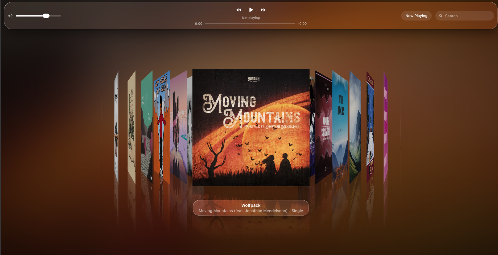
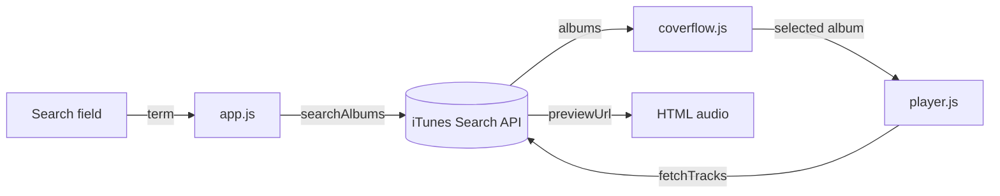

<h1 align="center" style="text-align: center;">Coverflow</h1>

<p align="center" style="text-align: center;">
  <strong>A modern take on Apple's Cover Flow, built with Liquid Glass and the iTunes Search API.</strong>
</p>

<p align="center" style="text-align: center;">
      
</p>

<p align="center" style="text-align: center;">
  
</p>

A school project that rebuilds the iOS-era Cover Flow album browser with today's Liquid Glass look. Search any artist or album, flick through the covers in 3D, and listen to 30-second previews, all with plain HTML, CSS and JavaScript.

## Features

- **3D Cover Flow**: covers tilt in perspective with mirrored reflections and spring animations.
- **Liquid Glass UI**: a floating, translucent toolbar that refracts a blurred copy of the selected cover.
- **Live search**: albums come straight from the iTunes Search API as you type.
- **Preview playback**: play, pause, skip, seek and set the volume. Moving to another cover switches the music to that album, and when an album ends the flow moves on to the next one.
- **System media controls**: keyboard media keys and the OS "now playing" widget show the track and artwork.
- **Accessible and responsive**: keyboard navigation, visible focus, support for reduced motion and reduced transparency, and a compact layout for phones.

## Getting started

### Requirements

- A modern browser (Safari, Chrome, Edge, Brave or Firefox).
- Any static file server. The app uses ES modules, which browsers won't load from `file://`, so opening `index.html` directly doesn't work.

There is nothing to install: no `npm install`, no build step and no API key.

### Run it

```bash
git clone https://github.com/ikabeee/coverflow.git
cd coverflow

# Pick any static server:
python3 -m http.server 8000
# or
npx serve .
```

Open <http://localhost:8000> (or the URL `serve` prints). The app starts with a search for “Moving Mountains”.

### Controls

| Action | Mouse / touch | Keyboard |
| --- | --- | --- |
| Browse albums | Click a side cover | <kbd>←</kbd> / <kbd>→</kbd> (with the flow focused) |
| Play the centered album | Click the centered cover or ▶ | <kbd>Enter</kbd> |
| Previous / next track | ⏮ / ⏭ | Media keys |
| Seek | Drag the progress bar | Arrow keys on the bar |
| Jump back to the playing album | **Now Playing** | — |
| Search | Type in the search field | <kbd>Enter</kbd> searches right away |

## How it works



1. `app.js` sends the search term to `searchAlbums()` and hands the results to the Cover Flow.
2. `coverflow.js` draws the covers and reports which album is selected.
3. When you play an album, `player.js` asks `fetchTracks()` for its songs and plays their previews one after another in an `<audio>` element.

### Consuming the iTunes Search API

All API access lives in [`src/albums/itunes.js`](src/albums/itunes.js). The API is public: it needs no key or account, and it sends `Access-Control-Allow-Origin: *`, so the browser can call it directly with `fetch` and no proxy.

**1. Searching albums**: `searchAlbums(term)`

```http
GET https://itunes.apple.com/search?term=death+cab+for+cutie&media=music&entity=album&limit=30&country=US
```

| Parameter | Value | Why |
| --- | --- | --- |
| `term` | The search text | What the user typed. |
| `media` | `music` | Leaves out movies, podcasts, apps and books. |
| `entity` | `album` | Returns albums (`collection`) instead of songs. |
| `limit` | `30` | Enough covers to fill the flow. |
| `country` | `US` | The store to search. |

Each result is turned into the small object the UI works with:

```js
{
  id: result.collectionId,        // used later to look up the tracks
  artist: result.artistName,
  title: result.collectionName,
  artwork: result.artworkUrl100,  // upscaled, see below
  url: result.collectionViewUrl,
  year: result.releaseDate?.slice(0, 4),
}
```

> [!TIP]
> The API only returns 100×100 thumbnails (`…/100x100bb.jpg`). Apple's image server makes other sizes from that same URL, so the app swaps the size part for `600x600bb` to get sharp covers.

**2. Looking up an album's tracks**: `fetchTracks(albumId)`

```http
GET https://itunes.apple.com/lookup?id=966379289&entity=song&limit=200&country=US
```

The first result is the album itself, followed by its songs. The app keeps only the songs that have a `previewUrl`, sorts them by `discNumber` and `trackNumber`, and plays those preview files.

**3. Being a good API citizen**

- **Only the latest search counts.** Each new search cancels the one still in flight (`AbortController`), so a slow reply can't replace newer results.
- **Debounced requests.** Searching waits 400 ms after the last keystroke. Switching albums while browsing waits 350 ms for the flow to settle, so flicking through ten covers makes one track lookup, not ten.
- **Clear states.** Loading, empty results and network errors each show a message in the caption instead of failing silently.

> [!NOTE]
> **Limitations of the API**
>
> - Only **30-second previews** are available. Full songs would require [Apple MusicKit](https://developer.apple.com/musickit/), which needs a developer account and a user subscription.
> - Apple allows **about 20 calls per minute**. Going over it can get requests blocked for a while.
> - Some albums have no previews; the player then shows “No previews available”.

### The Liquid Glass look

Everything is plain CSS, in [`src/coverflow/coverflow.css`](src/coverflow/coverflow.css):

- **Glass material**: a translucent fill with `backdrop-filter: blur() saturate()`, a light inner shadow on the top edge, and a gradient rim (masked with `mask-composite`) that looks like light catching the edge.
- **Something to refract**: behind the glass sits a heavily blurred copy of the selected cover, so the toolbar and caption pick up the album's colors.
- **3D flow**: each cover gets two numbers from JavaScript, which side of the center it's on (`--side`) and how far away it is (`--distance`). The tilt, spacing, depth and fading are all calculated in CSS from those two values.
- **Reflections**: a flipped copy of each cover that fades out with a gradient mask.
- **Accessibility**: `prefers-reduced-transparency` makes the glass opaque and `prefers-reduced-motion` turns off the animations.

## Project structure

```text
coverflow/
├── index.html                  # Page markup: toolbar, flow and caption
├── docs/
│   └── cover.png               # README screenshot
└── src/
    ├── app.js                  # Startup: search, debounce and wiring between modules
    ├── albums/
    │   └── itunes.js           # iTunes Search API: searchAlbums() and fetchTracks()
    ├── coverflow/
    │   ├── coverflow.js        # Renders covers, selection and keyboard navigation
    │   └── coverflow.css       # Liquid Glass styles, 3D geometry and responsive layout
    └── player/
        └── player.js           # Audio playback, track queue, toolbar controls and Media Session
```

## Credits

Inspired by Cover Flow from iPod and iOS and by Apple's Liquid Glass design language. Album data, artwork and previews come from the [iTunes Search API](https://performance-partners.apple.com/search-api) and belong to their respective owners. This is an educational project and is not affiliated with Apple.
